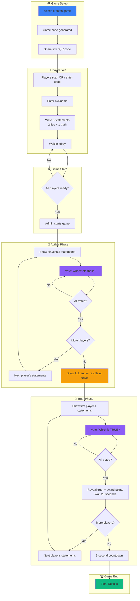

# 🧊 Brizglass Game

A fun team-building game where players get to know each other through guessing games.

## Game Flow



## Game Phases Explained

### Phase 1: Author Guessing (No Reveals)
Players see each person's statements one by one and vote on who wrote them. **Important**: No results are revealed between rounds - this prevents players from knowing who hasn't been guessed yet (which would make the last round obvious).

### Phase 2: Author Results
After all author votes are collected, ALL results are shown at once on a single screen. Players see who wrote each set of statements and who guessed correctly.

### Phase 3: Truth Guessing (With Reveals)
Players now vote on which statement is true for each person. After each vote, the truth is immediately revealed and points are awarded. The game auto-advances after 20 seconds.

### Phase 4: Final Results
After a 5-second countdown, final scores are displayed with the winner highlighted.

## Scoring System

| Action | Points |
|--------|--------|
| Correctly guess the statement author | +1 |
| Correctly identify the true statement | +1 |
| Fool someone with your false statement | +1 |

## API Endpoints

| Endpoint | Method | Description |
|----------|--------|-------------|
| `/api/game/create` | POST | Create a new game |
| `/api/game/join` | POST | Join a game with code + nickname |
| `/api/game/statements` | POST | Submit 3 statements |
| `/api/game/start` | POST | Start the game (admin) |
| `/api/game/vote` | POST | Submit a vote (auto-advances when all voted) |
| `/api/game/auto-advance` | POST | Auto-advance from results phases |
| `/api/game/[code]/status` | GET | Get current game status |

## Data Model

### Collections

- **Games**: Game sessions with code, status, currentRound, truthRound, and playerOrder
- **Players**: Players with nickname, score, and session
- **Statements**: 3 per player (2 false, 1 true)
- **Votes**: Records of all votes cast

### Game Statuses

1. `lobby` - Waiting for players to join and submit statements
2. `voting-author` - Players vote on who wrote the statements (cycles through all players)
3. `results-author` - Show ALL author results at once
4. `voting-truth` - Players vote on which statement is true (one player at a time)
5. `results-truth` - Reveal the true statement (auto-advances after 20s)
6. `finished` - Game over, show final scores

### Key Fields

- `currentRound` - Tracks which player's statements are being shown during author phase
- `truthRound` - Tracks which player is being guessed during truth phase
- `playerOrder` - Randomized array of player IDs determining the order of play

## Getting Started

```bash
# Install dependencies
pnpm install

# Start development server
pnpm dev

# Generate types after schema changes
pnpm generate:types
```

## Tech Stack

- **Framework**: Next.js 15 + React 19
- **CMS**: Payload CMS 3.0
- **Database**: MongoDB
- **Real-time**: PartyKit WebSockets
- **Styling**: CSS
- **QR Codes**: qrcode.react
