# 🧊 Icebreaker Game

A fun team-building game where players get to know each other through guessing games.

## Game Flow

```mermaid
flowchart TD
    subgraph Setup["🎮 Game Setup"]
        A[Admin creates game] --> B[Game code generated]
        B --> C[Share link / QR code]
    end

    subgraph Join["👥 Player Join"]
        C --> D[Players scan QR / enter code]
        D --> E[Enter nickname]
        E --> F[Write 3 statements<br/>2 lies + 1 truth]
        F --> G[Wait in lobby]
    end

    subgraph Start["▶️ Game Start"]
        G --> H{All players ready?}
        H -->|No| G
        H -->|Yes| I[Admin starts game]
    end

    subgraph Round["🔄 Game Round"]
        I --> J[Show player's 3 statements]
        J --> K[Vote: Who wrote these?]
        K --> L{All voted?}
        L -->|No| K
        L -->|Yes| M[Reveal author + award points]
        M --> N[Vote: Which is TRUE?]
        N --> O{All voted?}
        O -->|No| N
        O -->|Yes| P[Reveal truth + award points]
    end

    subgraph Loop["🔁 Continue"]
        P --> Q{More players?}
        Q -->|Yes| R[Next player's statements]
        R --> J
        Q -->|No| S[🏆 Final Results]
    end

    style A fill:#3b82f6
    style S fill:#10b981
    style K fill:#8b5cf6
    style N fill:#8b5cf6
```



## Scoring System

| Action | Points |
|--------|--------|
| Correctly guess the statement author | +1 |
| Correctly identify the true statement | +1 |
| Fool someone with your false statement | +1 |

## API Endpoints

| Endpoint | Method | Description |
|----------|--------|-------------|
| `/api/game/create` | POST | Create a new game |
| `/api/game/join` | POST | Join a game with code + nickname |
| `/api/game/statements` | POST | Submit 3 statements |
| `/api/game/start` | POST | Start the game (admin) |
| `/api/game/vote` | POST | Submit a vote |
| `/api/game/next-phase` | POST | Advance to next phase (admin) |
| `/api/game/[code]/status` | GET | Get current game status |

## Data Model

### Collections

- **Games**: Game sessions with code, status, and current round
- **Players**: Players with nickname, score, and session
- **Statements**: 3 per player (2 false, 1 true)
- **Votes**: Records of all votes cast

### Game Statuses

1. `lobby` - Waiting for players to join and submit statements
2. `voting-author` - Players vote on who wrote the statements
3. `results-author` - Show who wrote the statements
4. `voting-truth` - Players vote on which statement is true
5. `results-truth` - Reveal the true statement
6. `finished` - Game over, show final scores

## Getting Started

```bash
# Install dependencies
pnpm install

# Start development server
pnpm dev

# Generate types after schema changes
pnpm generate:types
```

## Tech Stack

- **Framework**: Next.js 15 + React 19
- **CMS**: Payload CMS 3.0
- **Database**: MongoDB
- **Styling**: CSS
- **QR Codes**: qrcode.react
